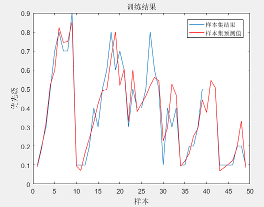
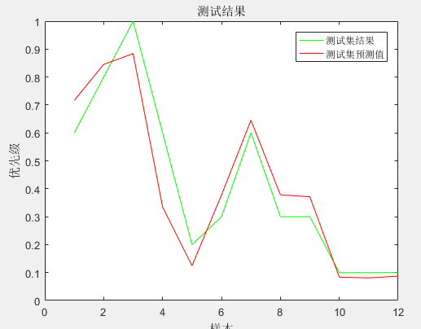

# fwnn-matlab
Implementation of Fuzzy Wavelet Neural Network in Matlab and Evaluation of Target Threat  
模糊小波神经网络的Matlab实现以及目标威胁评估

## 综述
运行文件为fwnn.m，语言为Matlab语言，实现了对于五个影响因素下的目标威胁度（或攻击优先级）评估，以RoboMaster为例讲解。

## 运行
填写样本集.xlsx，转化为Dat文件，在FWNN中读入并训练，接着读取测试集.dat数据并进行测试。

## 原理
原理见PDF文件

## 运行结果
训练拟合结果如下图所示：

预测结果如下图所示：

## 联系方式
如有疑问请联系13051613182@163.com

如果觉得有用请给个Star吧~